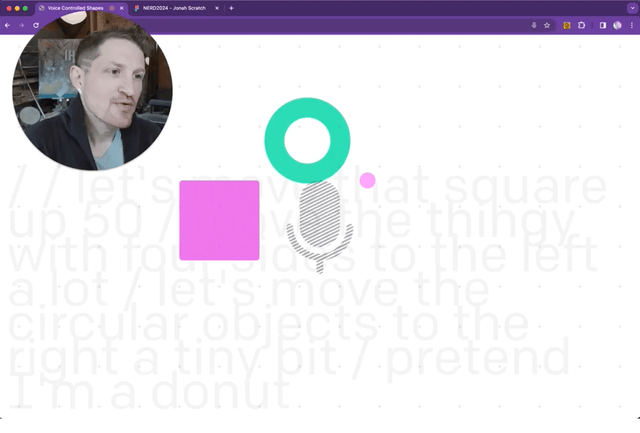

# Voice-movemenent with an LLM




## Why

**TLDR: A demo of freeing LLM from the chat box.**

At NERD Summit 2024, hosted at the University of Massachusetts,  I challenged the audience to imagine and use LLMs outside the comfortable confines of the chat-box modality.

I decided to create a quick example showing how we could quickly create a voice-only experience for moving objects around the screen just by describing them, without needing to learn specific commands (the way most current voice assistants require(d)). Potential uses for environments requiring hands-free work, and certainly for various a11y use cases!

A [short demo video](https://www.linkedin.com/feed/update/urn:li:activity:7183837944942600194/) recorded after the conference

If you want to update to OpenAI's state-of-the-art model, you can update the model name in `pages/api/generate.js`

## Setup:

1. If you don’t have Node.js installed, [install it from here](https://nodejs.org/en/) (Node.js version >= 14.6.0 required)

1. In your project dir, install the requirements

   ```bash
   $ npm install
   ```

1. Make a copy of the example environment variables file

   On Linux systems: 
   ```bash
   $ cp .env.example .env
   ```
   On Windows:
   ```powershell
   $ copy .env.example .env
   ```
1. Add your own [OpenAI API key](https://platform.openai.com/account/api-keys) to the newly created `.env` file

1. Run the app

   ```bash
   $ npm run dev
   ```

1. Launch via [http://localhost:3000](http://localhost:3000)


### Things I'd like to get to:
- Respond to:
	* Relative movement
	* Speed
	* Concept of viewport and diagonal movement ("move to the top right corner")
- Give selected objects a clear visual signifier


## Built using:
- [React](https://reactjs.org/)
- [Next.js](https://nextjs.org/)
- [Framer Motion](https://www.framer.com/motion/)
- [SpeechRecognition](https://developer.mozilla.org/en-US/docs/Web/API/SpeechRecognition) (A native browser API!)


This demo was built on top of OpenAI's API [quickstart tutorial](https://platform.openai.com/docs/quickstart) for Node.js
